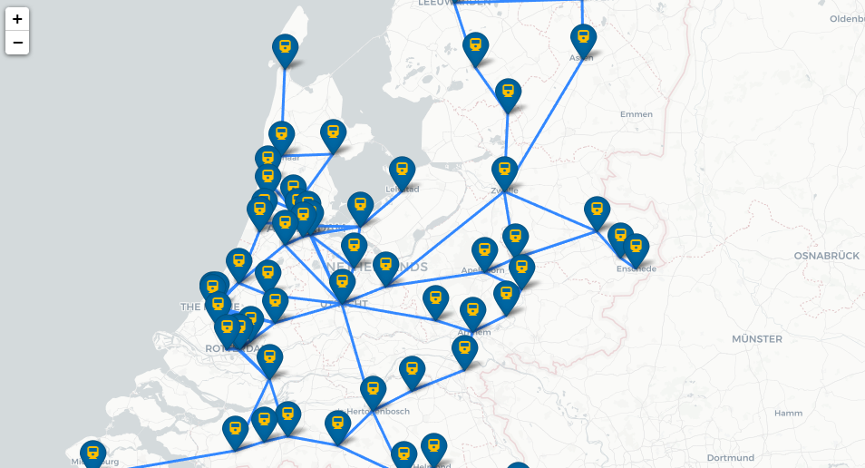

# Trainspotters <br> [](https://github.com/psf/black) 

Vak: [Programmeertheorie 2022](theorie.mprog.nl) <br>
Gekozen case: [RailNL](https://theorie.mprog.nl/cases/railnl) <br>
Teamnaam: Trainspotters <br>
Studenten: Sam Bijhouwer, Maik Larooij

## Caseomschrijving

RailNL wil een nieuwe lijnvoering maken voor hun intercitytreinen. Binnen een bepaald tijdsframe moeten er een aantal trajecten worden uitgezet waarbij de kwaliteit van de lijnvoering zo hoog mogelijk is. Dat betekent het verbinden van zoveel mogelijk stations met zo min mogelijk trajecten en minuten. De case bestaat uit twee delen:

- Het maken van een lijnvoering voor de provincies Noord- en Zuid-Holland. De 22 belangrijkste stations moeten worden verbonden met maximaal 7 trajecten binnen een tijdsframe van 2 uur.
- Het maken van een lijnvoering voor heel Nederland. De 61 belangrijkste stations moeten worden verbonden met maximaal 20 trajecten binnen een tijdsframe van 3 uur.

Om de kwaliteit van de lijnvoering te testen is de volgende doelfunctie opgesteld:
```
K = p*10000 - (T*100 + Min)
```
Waarin K = de kwaliteit van de lijnvoering, p = de fractie van alle gereden verbindingen van het totaal aantal verbindingen, T = het aantal trajecten en Min = het aantal minuten van alle trajecten samen.

### Verkenning

[Klik hier](https://nbviewer.org/github/maiklarooij/Trainspotters/blob/main/milestones/exploration.ipynb) om een verkenning van de stations en connecties te bekijken. Dit is gemaakt met `folium` in een Jupyter Notebook zodat de visualisatie interactief kan worden bekeken. Dit ziet er ongeveer zo uit:



## Gebruik

### Vereisten
De code is geschreven in Python 3.9. De benodigde packages om de code te kunnen draaien staan in `requirements.txt`. Door middel van het volgende commando zijn deze te installeren via pip:
```
pip install -r requirements.txt
```
Of via conda:
```
conda install --file requirements.txt
```

### Commando en parameters

Simpel, gewoon:

```
python main.py
```

Er verschijnt nu een menu waarin je het algoritme dat je wilt draaien helemaal kunt instellen!

Het programma kan ook op de volgende manier een algoritme draaien:

```
python main.py scale algorithm
```

Bijvoorbeeld het random algoritme op Holland:

```
python main.py Holland random
```

Het breadth-first algoritme heeft een parameter die kan worden meegegeven:

- `-bm`: Beam-waarde, aantal opties om te behouden elke iteratie

```
python main.py -s Nationaal -a bf -bm 15
```

Het genetisch algoritme heeft een aantal parameters die kunnen worden gekozen:

- `-gs`: Aantal random genes (routes) om te genereren
- `-ps`: Aantal random combinaties van routes om te genereren
- `-mr`: Mutatiekans
- `-gn`: Aantal generaties (aantal iteraties) van het algoritme
- `-hc`: Optie om Hillclimber te gebruiken als mutatieoptie
- `-sl`: Selectiemethode ('rws', 'elitism' of 'tournament')
- `-br`: Breeding-methode ('1point', '2point' of 'uniform')

```
python main.py -s Nationaal -a genetic -gs -ps -mr -gn -hc -sl -br
```

Het hillclimber algoritme heeft twee parameters die kunnen worden gekozen:

- `-re`: Aantal restarts
- `-r`: Aantal willekeurige routes die het algoritme genereert en probeert toe te voegen per iteratie

```
python main.py -s Nationaal -a genetic -re 10 -r 1000
```

Voor hulp bij het draaien van het programma probeer:

```
python main.py -h
```

### Commando experiment

Om een experiment te draaien dien je een schaal en een algoritme mee te geven:

```
python src/experiment/experiment.py -s Nationaal -a hillclimber
```

Als er geen algoritme wordt meegegeven worden alle experimenten achter elkaar gedraaid.
Het resultaat van het experiment wordt opgeslagen onder `/results/experiment/experiment_algorithm.csv`

### Structuur

De mappen in deze repository:
- /src: bevat de code van dit project
    - /src/algorithms: bevat de algoritmes
    - /src/classes: bevat de benodigde classes
    - /src/experiment: bevat een script om een experiment te draaien
    - /src/visualisation: bevat code om visualisaties te maken
- /data: bevat de input data van dit project
- /doc: bevat belangrijke documenten, zoals pseudocodes en ondersteunende plaatjes
- /milestones: bevat milestones en twee notebooks met verkenning
- /results: bevat resultaten, zowel interactieve visualisaties als statische plots

## Auteurs

"Trainspotters" is een project voor de Universiteit van Amsterdam gemaakt door:

- Sam Bijhouwer
- Maik Larooij