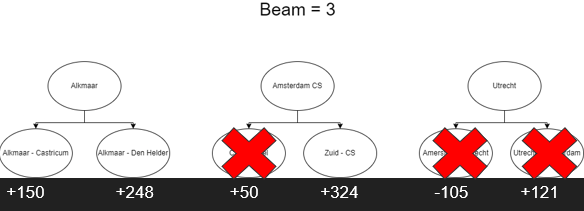
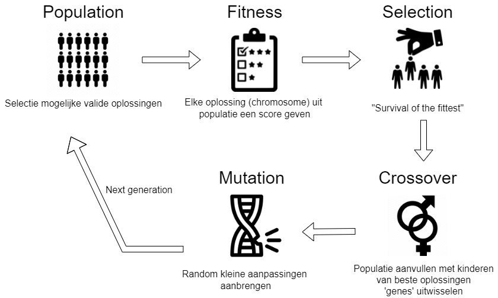

# Algorithms

Deze folder bevat alle code voor de algoritmen die zijn gescheven. Voor pseudocodes van de algoritmen, [klik hier](../../doc/pseudocode.md).

## randomise.py

Bevat code om random routes en daarmee random routemaps te creëren. Het algoritme kiest eerst random hoeveel trajecten er worden gemaakt (gebaseerd op de schaal, Holland of Nationaal). Elk traject begint met een random start station en genereert dan nieuwe mogelijkheden. Uit deze mogelijkheden wordt een nieuw random station gekozen. Dit gaat zo door totdat de maximale tijd van een traject is bereikt.

Voor pseudocode en resultaten van `randomise.py`, [klik hier](../../milestones/baseline.md)

## greedy.py

Bevat code om op een 'greedy' manier routes en daarmee routemaps te creëren. Het is de eerste stap richting het breadth-first search algoritme, aangezien het beide deterministische algoritmen zijn (= komt altijd op hetzelfde resultaat uit). Per traject kiest het algoritme het station met de meeste connecties dat op dat moment nog niet gezien is. Vervolgens worden er nieuwe opties toegevoegd op basis van een scoreverbetering. De optie met de hoogste nieuwe score wordt gekozen en toegevoegd. Dit gaat zo door totdat er geen verbetering meer mogelijk is.

## breadthfirst.py

Bevat code om een routemap met routes te creëren door middel van het breadth-first algoritme. Het algoritme begint met routes met daarin telkens een ander start station. Per start station worden alle mogelijke vervolgopties overwogen. Afhankelijk van de beam-waarde worden de x opties met de hoogste increase in score gekozen voor de volgende diepte. Dit gaat zo door totdat er geen routes meer worden gevonden die de score verbeteren.

Te zien in onderstaand voorbeeld worden de drie meest verbeterende opties gekozen voor de volgende stap bij een beam-waarde van 3.

Voor pseudocode en resultaten van `breadthfirst.py`, [klik hier](../../milestones/first_algorithm.md)

## hillclimber.py

TODO - SAM

## genetic.py

Bevat code om een routemap met routes te creëren door middel van een genetisch algoritme. Dit algoritme bestaat uit een aantal stappen, deze zijn te zien in onderstaand schema.

Belangrijke stappen:
- Selection: de oplossingen kiezen die het overleven tot de volgende generatie. Voor info, [klik hier](https://en.wikipedia.org/wiki/Selection_(genetic_algorithm)). De volgende methoden zijn uitgewerkt:
    - Roulette-wheel selection: hierbij is de kans om gekozen te worden proportioneel met de fitness van de optie. Hoe beter de fitness, hoe hoger de kans om gekozen te worden
    - Elitism selection: hierbij worden alleen de beste x% van de opties meegenomen naar de volgende generatie
    - Tournament selection: hierbij wordt er een heel aantal keer een willekeurig sample genomen uit de populatie, waarvan vervolgens de hoogste score het overleeft
- Crossover: aangezien er oplossingen 'sneuvelen', moeten er ook weer nieuwe oplossingen bij komen. Dit gebeurt door goede oplossingen te combineren. Voor meer info, [klik hier](https://en.wikipedia.org/wiki/Crossover_(genetic_algorithm)). De volgende methoden zijn uitgewerkt:
    - 1-point crossover: hier wordt een willekeurig punt gekozen waarop beide ouders worden doorgehakt. Het kind krijgt een deel van beide ouders
    - 2-point crossover: hetzelfde als 1-point crossover, alleen wordt er nu op twee willekeurige punten gesneden
    - Uniform crossover: hierbij wordt elk deel van het kind willekeurig gekozen van één van de ouders met dezelfde kans (50/50 dus)
- Mutation: om variatie te houden in de populatie, muteren de opties op basis van een mutatie-kans. Dit kan met onze oplossing op twee manieren:
    - Een random gene (een route) wordt vervangen door een random nieuwe gene uit de set van begin-opties
    - De optie 'hillclimber' kan worden aangezet, telkens wanneer het algoritme 10% verder is gekomen hebben de opties de kans om te muteren op basis van het hillclimber algoritme, zodat ze snel een goede oplossingen kunnen vinden

Voor pseudocode en resultaten van `genetic.py`, [klik hier](../../milestones/second_algorithm.md)